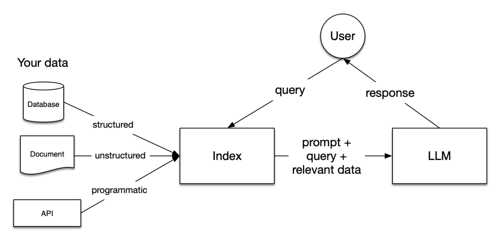

# GitaGPT 
A Bhagavad Gita chatbot/QA based on Retrieval-Augmented Generation (RAG) that will provide wisdom regarding life. Built using *llama3.2* model and *llamaindex*.


## Tech Stack used 
framework: `llamaindex`

model: `meta-llama/Llama-3.2-1B-Instruct` (huggingface)

embedding: `BAAI/bge-mini-en-v1.5` (huggingface)

vectorDB: `chromadb`

interface: `gradio`

## Introduction
**Retrieval-Augmented Generation (RAG)** introduced in [2020](https://arxiv.org/abs/2005.11401) is a powerful new approach in language modeling that improves the quality and accuracy of responses generated by Large Language Models (LLMs) by relying on external knowledge for revelant context.



RAG is leveraged here along with a small opensource model for the project so that extra compute is not wasted to train a model from scratch or finetuning while also making it flexible.

## Pre-requirements
* In addition to the packages required, you need to have [access](https://huggingface.co/docs/hub/en/models-gated#access-gated-models-as-a-user) to [llama3.2](https://llama.meta.com) models by Meta on [Huggingface](https://huggingface.co/meta-llama). After that, create a [huggingface access token](https://huggingface.co/docs/hub/en/security-tokens).

* A GPU with minimum of 16GB RAM is recommended for smooth and fast inference speed while a CPU can also run quite decently with that much VRAM.

## Running 

1. Download the repo zip file or use git clone 
```
git clone https://github.com/galax19ksh/GitaGPT.git 
cd GitaGPT
 ```
2. Install packages
```
pip install -r requirements.txt
```
3. First run the `init.py`. Then you can run `main.py` or `gradio_demo.py`. Provide huggingface access token when prompted in CLI (But it is optional on subsequent run with same parameters).

```
python init.py
```


**Note:** If you change parameters in `config.py`or add data files, make sure to run `init.py` first.


